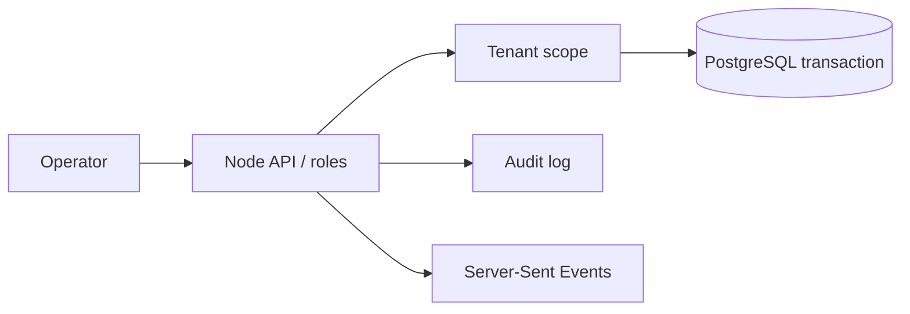

# Portfolio overview

## Architecture

## Core flow

1. An operator works inside an authenticated condominium scope.
2. A remote gate command requires role authorization, idempotency and expiry.
3. The command and audit record are committed together; the current provider is a simulation.

## Visual walkthrough

The public safe demo is hosted at https://jhonwictordev.github.io/PORTARIA360/ and uses fictional condominiums. It cannot contact physical devices.

## Environment and data

Use .env.example, Docker Compose and the migration command. JSON persistence is development-only; PostgreSQL is required for production.

## Decisions

- Gate delivery is deliberately simulated until a reviewed physical-provider adapter exists.
- A five-second cooldown and idempotency key protect against repeated commands.
- Tenant scope is resolved from membership, never only from a client header.
